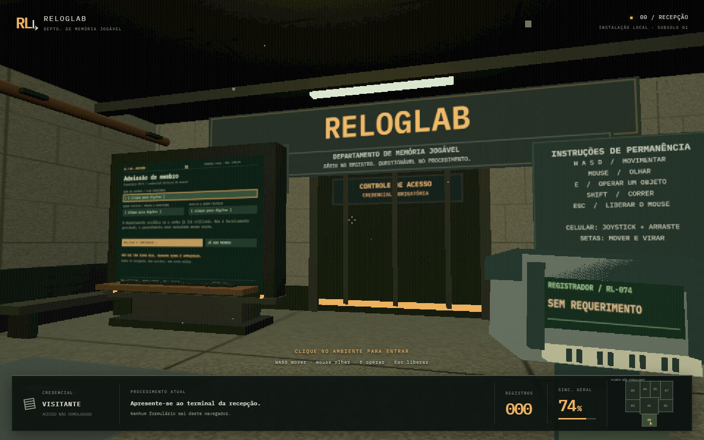

# RELOGLAB

**Departamento de memória jogável.**

Um arquivo de jogos que, por uma decisão administrativa indefensável, agora ocupa um complexo subterrâneo em primeira pessoa. Inspirado na linguagem visual de Doom, Quake e instalações industriais da década de 1990. Sucessor do [LogLab](https://github.com/erereck/loglab).

**Sério no registro. Questionável no procedimento.**



## Entrar

[Abrir a instalação](https://erereck.github.io/reloglab/)

Clique no ambiente, caminhe até o terminal da recepção e pressione **E**. Os formulários são texturas interativas dos monitores 3D: a câmera se aproxima do equipamento, e você preenche os campos ali. Não há páginas, menus de navegação ou diálogos flutuantes.

| Controle            | Procedimento                                                       |
| ------------------- | ------------------------------------------------------------------ |
| WASD                | Caminhar                                                           |
| Mouse               | Olhar com o cursor capturado; arrastar também funciona sem captura |
| Shift               | Correr                                                             |
| E / clique          | Operar terminal, carregar ou soltar um bloco                       |
| Esc                 | Levantar do terminal / liberar o mouse                             |
| Setas               | Mover e virar; selecionar controles no terminal                    |
| Page Up / Page Down | Olhar para cima / baixo sem mouse                                  |
| Tab / Shift+Tab     | Próximo / anterior controle do terminal                            |
| Enter               | Acionar um controle ou concluir a digitação                        |
| Celular             | Joystick à esquerda; arraste o ambiente para olhar; toque em E     |

## Os setores

| Setor                  | Função                                                                                                                               |
| ---------------------- | ------------------------------------------------------------------------------------------------------------------------------------ |
| 00 — Recepção          | Cadastro fictício, recusa obrigatória da primeira senha, login local e porta de acesso                                               |
| 01 — Distribuição      | Átrio e máquina de sincronização permanentemente estacionada em 74%                                                                  |
| 02 — Arquivo           | 499 títulos; pesquisa parcial ou exata; filtro de gênero; seleção do jogo                                                            |
| 03 — Protocolo         | Situação, nota de 0 a 10, data, observação e intenção de rejogar; recibo físico após salvar                                          |
| 04 — Terreno do perfil | Registros como blocos reais, transporte em primeira pessoa, arraste no monitor, organização aleatória, restauração, edição e remoção |
| 05 — Estatística       | Total, média, conclusão, distribuição por situação e gênero mais frequente                                                           |
| 06 — Ajuda             | Seis placas de FAQ em um corredor. A rolagem horizontal é o visitante                                                                |
| 07 — Preferências      | Bio e gênero favorito funcionam; o estilo visual aguarda um comitê. Som e redução de movimento também funcionam                      |
| 07-B — Custódia        | Exportação JSON, importação e descarte com confirmação no monitor                                                                    |

A saída está discretamente instalada na porta de manutenção, no fundo das preferências. O perfil físico mostra até 80 blocos; **Inspecionar todos** permite editar cada registro do arquivo, inclusive os demais.

## Dados de verdade, conta de mentira

- Conta, registros, posições e preferências ficam em `localStorage`, em `reloglab.v1`.
- A sessão usa `sessionStorage`. Nenhum dado de usuário é enviado a um servidor.
- **Não use uma senha real.** As senhas fictícias não são armazenadas, exportadas nem verificadas contra uma base de senhas. O login aceita uma senha demonstrativa de quatro caracteres e o nome da credencial local.
- A primeira senha do cadastro é recusada uma vez por sessão do navegador. A alegação de que outro membro usa a senha é parte da ficção burocrática.
- O número 74% é uma simulação; salvar um registro não depende dele.
- Se o armazenamento estiver indisponível, o HUD e os monitores informam que o arquivo é temporário. Use a exportação para preservá-lo.
- Para levar os dados a outro navegador, use **Exportar arquivo** e **Importar** na custódia. Uma importação válida substitui o arquivo atual e encerra a sessão.
- Também aceita o `loglab-export.txt` do projeto original; remove o campo de senha e redistribui as antigas posições 2D no terreno 3D.
- Arquivos de até 5 MB, com até 3.000 registros, são validados antes da substituição.

## Rodar localmente

Requer Node.js 22.12+.

```sh
npm ci
npm run dev
```

Abra a URL fornecida pelo Vite. WebGL 2 é necessário. Não abra `index.html` com `file://`.

```sh
npm run build
npm run preview
```

O build em `dist/` é estático e usa caminhos relativos, compatíveis com GitHub Pages e hospedagem estática. Fonte, catálogo, texturas, sons sintetizados e geometrias são locais; não há chamadas a APIs, contas externas nem CDNs.

## Verificação

```sh
npx playwright install chromium
npm test
```

Os testes percorrem a instalação pelo teclado e acionam os controles dos monitores com coordenadas projetadas do mundo. Cobrem cadastro, recusa inicial, login, portas, pesquisa, registro, arraste, edição, estatística, FAQ, preferências, exportação, saída, persistência, importação e controle em celular. No Windows, usam o Edge instalado; em outros ambientes, defina `PLAYWRIGHT_CHANNEL=chromium` ou deixe o Chromium padrão.

A sincronização em 74% e o transporte dos blocos no mundo também são exercitados. O [relatório de homologação](docs/VERIFICACAO.md) registra a verificação inicial. Os mesmos testes são exigidos pelo workflow antes de publicar cada atualização.

As informações de diagnóstico usadas pelos testes só existem no modo de desenvolvimento e são de leitura. O build publicado não inclui esses controles.

## Arquitetura

- `src/world.ts` — setores, geometria procedural, sinalização, colisão, portão e blocos do perfil.
- `src/screens.ts` — desenho dos monitores e áreas de interação; nenhum formulário é uma janela HTML.
- `src/main.ts` — movimento, câmera, raycasting, teclado, toque, arraste e instrumentação.
- `src/state.ts` — persistência, importação validada, exportação e estatísticas.
- `src/renderer.ts` — resolução reduzida ao caminhar, monitores em maior resolução, dithering e vinheta.
- `src/audio.ts` — ventilação, sinais de terminal e passos sintetizados com Web Audio.
- `src/registrar.ts` — registrador portátil em primeira pessoa, com indicador de interação físico.
- `src/catalog.ts` — catálogo preservado do LogLab, com Doom e Quake.

Three.js + TypeScript + Vite. Sem dependência de um framework de UI, modelos 3D remotos ou imagens de capas. IBM Plex Mono é distribuída sob a licença OFL incluída em `public/fonts/OFL.txt`.

## Publicação

O workflow `.github/workflows/pages.yml` compila, percorre a instalação com Playwright e publica em GitHub Pages a cada atualização da branch `main`. A fonte do Pages deve estar definida como **GitHub Actions**.

O departamento considera a versão 1.0 homologada. A sincronização considera a mesma versão 74% homologada.
