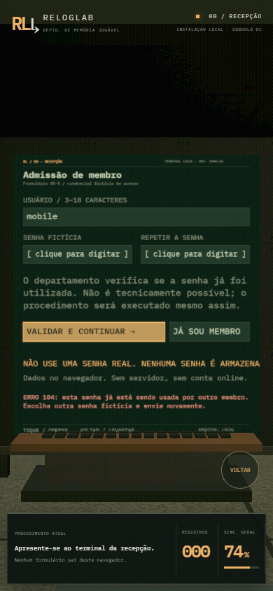

# Homologação da instalação

Verificação inicial em 27/09/2026. Build de produção aprovado, com TypeScript em modo estrito. Os três testes de navegador passaram em aproximadamente 3,4 minutos no ambiente local.

| Percurso                                        | Resultado                                                                                                     |
| ----------------------------------------------- | ------------------------------------------------------------------------------------------------------------- |
| Cadastro com nome, senha fictícia e confirmação | A primeira senha é recusada; a segunda emite a credencial sem conectar automaticamente                        |
| Login e portão                                  | Credencial validada; o acesso central abre                                                                    |
| Catálogo                                        | Pesquisa exata encontra DOOM e separa o título para o protocolo                                               |
| Registro                                        | Jogo, situação, nota, data, observação e intenção de rejogar são armazenados; o visitante permanece no balcão |
| Sincronização                                   | Reinicia a estimativa e estaciona novamente em 74%; não altera os registros                                   |
| Terreno                                         | Arraste no monitor e transporte com E alteram posições persistentes                                           |
| Edição                                          | Nota e observação são alteradas no equipamento do perfil                                                      |
| Estatística e FAQ                               | Setores alcançados por movimento com colisão; capturas dos instrumentos e placas                              |
| Preferências                                    | Bio, seleção de estilo consultivo e som são salvos                                                            |
| Exportação                                      | Download de JSON com o arquivo, sem senhas                                                                    |
| Saída escondida                                 | Botão físico da manutenção encerra a sessão e devolve à recepção                                              |
| Persistência                                    | Registros e posições continuam após recarregar, mesmo com a sessão encerrada                                  |
| Importação                                      | Exportação do LogLab é aceita; a senha antiga é descartada                                                    |
| Arquivo inválido                                | Transferência recusada sem substituir os dados atuais                                                         |
| Descarte                                        | Cancelamento preserva o arquivo; duas confirmações executam a remoção                                         |
| Celular                                         | Joystick move o visitante; campos do monitor recebem texto; o botão Voltar encerra a operação                 |

O percurso utiliza teclado, clique e raycasting sobre os objetos 3D. As informações de diagnóstico são de leitura e existem somente no servidor de desenvolvimento. Não há teleporte de teste nem chamadas diretas às funções de cadastro ou registro.

Ambiente local: Microsoft Edge, WebGL 2 e emulação de um dispositivo com toque de 390×844. A execução automatizada em GitHub Actions usa Chromium. A emulação não substitui uma matriz de testes em aparelhos físicos.

